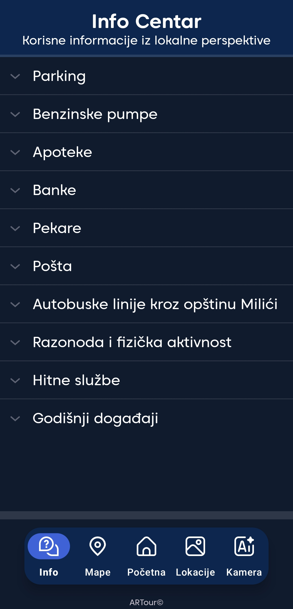
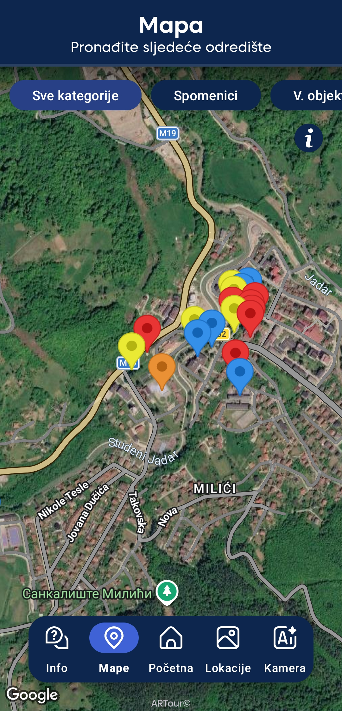
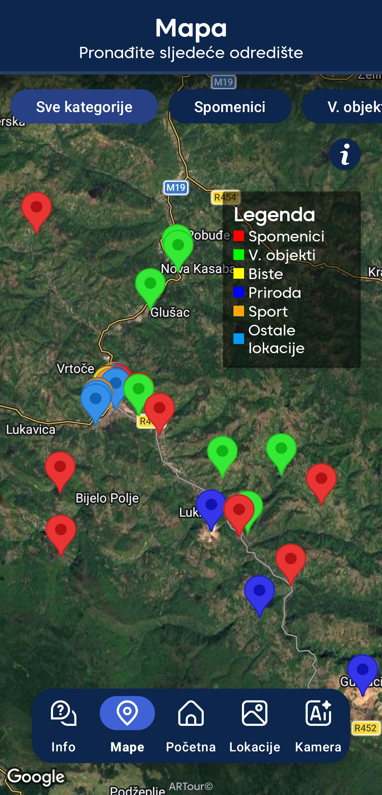
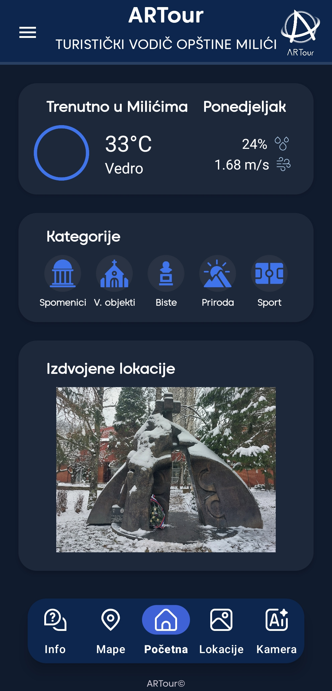
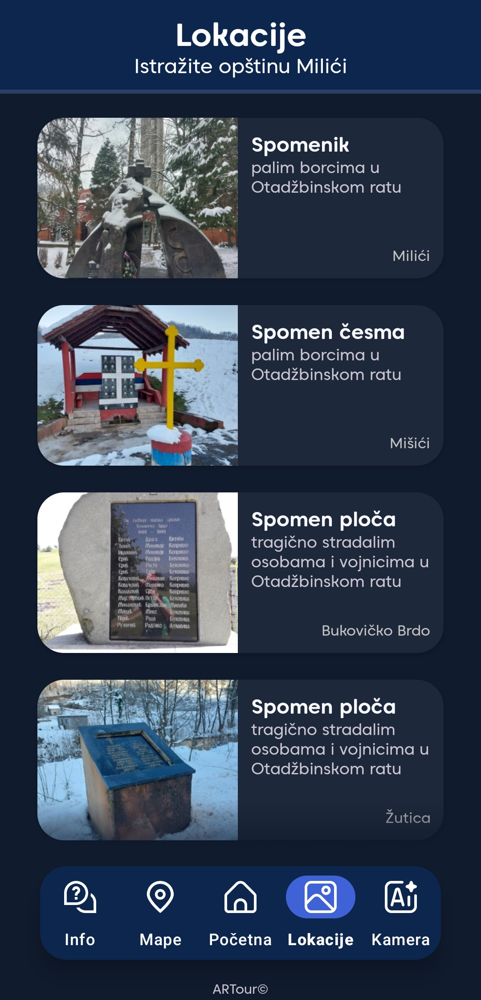
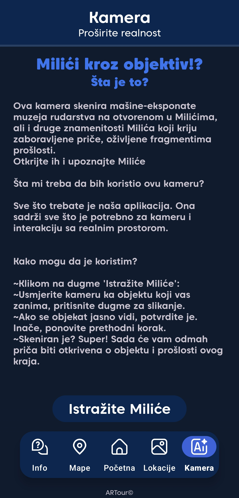
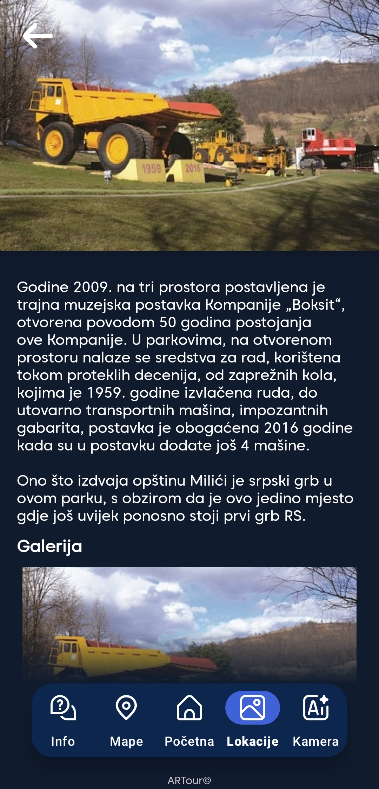
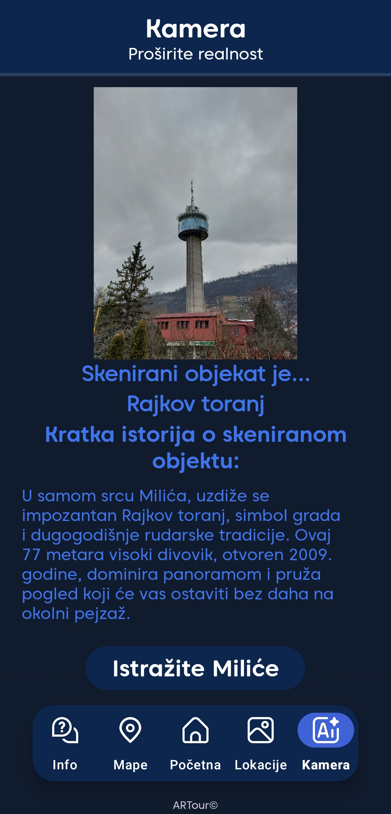

# ARTOUR

Artour is a mobile tourist guide for the Municipality of Milići, designed to help visitors and local residents 
  discover tourist attractions, important locations, and useful information about municipality.

The main feature of the application is an augmented reality camera that uses image recognition to identify local attractions.
Users can scan selected attractions using their device camera and receive information about the recognized location

## Features

* 📷 AR camera with image recognition
* 🗺️ Interactive map with important locations
* 📍 Detailed information about locations and attractions
* 🏞️ Tourist attractions organized by categories
* 📅 Information about local events
* 🏦 Information about services and facilities

## AR Camera

The main feature of ARTOUR is its augmented reality camera with image recognition.

Using image recognition, the application can recognize selected attractions in the Municipality of Milići, including the mining
machinery located in the Open-Air Mining Museum and Rajkov Tower

After an attraction is recognized, the application displays information and an image related to the recognized location

## Tourist Guide

ARTour provides a categorized overview of tourist attractions and important locations throughout the municipality.

Users can explore locations through an interactive map or browse them by category. Each location contains additional
  information and a description to help users learn more about the area.

The application also provides practical information about important local services and facilities, including: 

* Parking
* Gas stations
* Pharmacies
* Banks
* Shops and other facilities
* Emergency services
* Local events

## Map

The interactive map displays locations included in the application and allows users to explore the municipality and find
important places and tourist attractions.

## Screenshots

  
  
  

  
  
  

  
  

## Technologies
* Java
* Teachable Machine
* Google Maps
* Android

## Team Project

ARTour was developed as a collaborative project by the ***<b>iTek</b>*** team.

## Contributors
* Vladimir Erić
* Sergej Kaldesić
